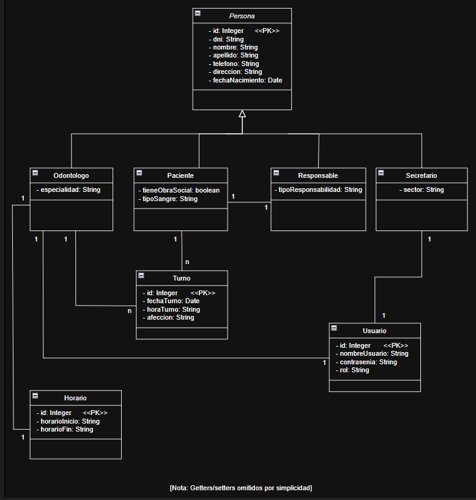
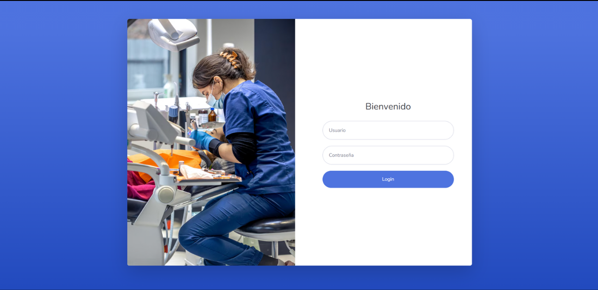
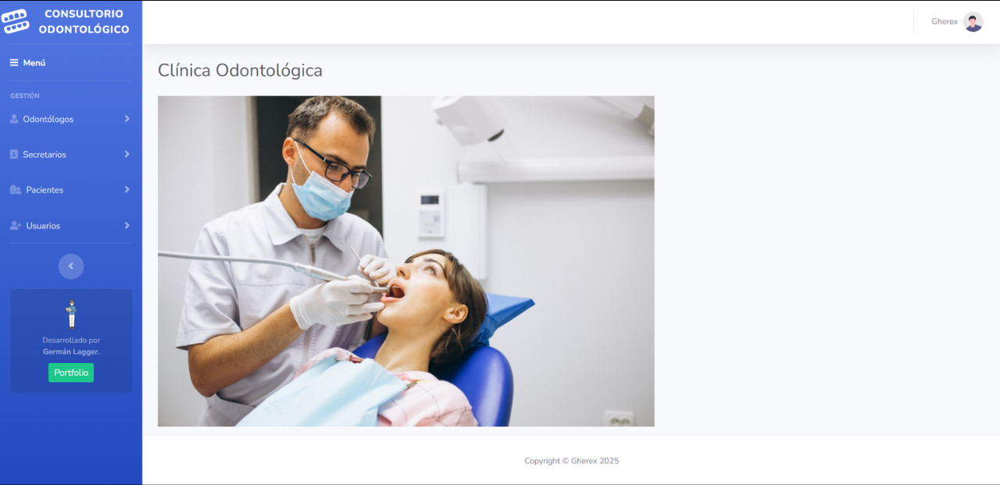
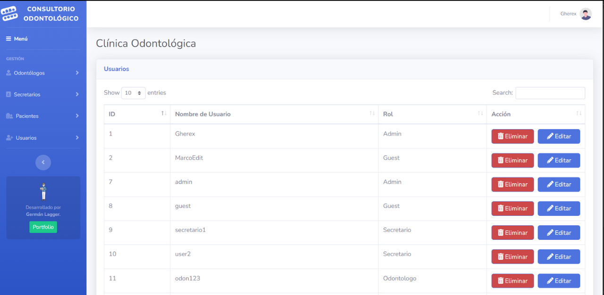
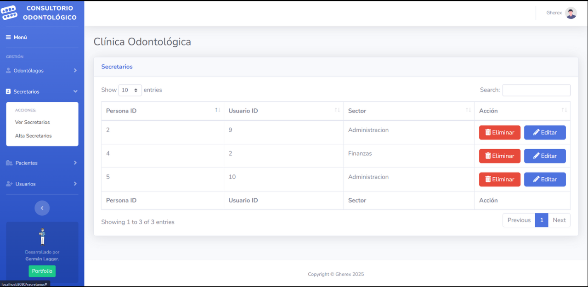
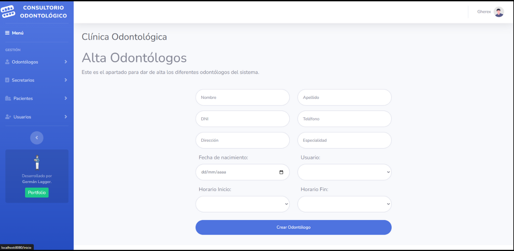

# 🦷 Consultorio Odontológico - Sistema de Gestión Web

¡Bienvenido a **Consultorio Odontológico**, una aplicación web para la gestión integral de pacientes, odontólogos, turnos y más!

## 📖 Descripción

Este proyecto fue desarrollado utilizando **Java EE** con **Servlets y JSP** para el backend y frontend, respectivamente. Implementa el patrón **MVC** y utiliza **JPA** para la persistencia de datos. La aplicación permite realizar operaciones CRUD sobre diversas entidades relacionadas con la gestión de un consultorio odontológico.

## 🧩 Características principales

- Gestión de usuarios, odontólogos, secretarios y pacientes
- Asignación y gestión de turnos
- Operaciones CRUD completas para todas las entidades
- Control de acceso mediante roles: admin, guest
- Interfaz web responsiva utilizando JSP y Bootstrap
- Persistencia de datos con JPA y MySQL
- Arquitectura basada en el patrón MVC

## 🛠️ Tecnologías utilizadas

### 🧠 Backend

- Java EE (Servlets y JSP)
- JPA (Jakarta Persistence API)
- MySQL
- Apache Tomcat
- Maven

### 💻 Frontend

- JSP (JavaServer Pages)
- HTML5
- CSS3
- Bootstrap

## 🗃️ Modelo de Base de Datos

El sistema cuenta con las siguientes entidades principales:

- `Persona` (clase abstracta)
  - `Paciente`
  - `Odontólogo`
  - `Secretario`
  - `Responsable`
- `Usuario`
- `Turno`
- `Horario`

Cada entidad está relacionada adecuadamente para representar las operaciones de un consultorio odontológico.



## 📷 Capturas de pantalla







## 🚀 Cómo ejecutar el proyecto

### 🔙 Backend

1. Clonar el repositorio:
   ```sh
   git clone https://github.com/Gherex/consultorio-odontologico.git
   ```
2. Importar el proyecto en tu IDE favorito (NetBeans / IntelliJ / Eclipse).
3. Configurar las credenciales de la base de datos en `src/main/resources/META-INF/persistence.xml`.
4. Crear la base de datos `consultorio_odontologico` en MySQL y asegurarse de que esté corriendo.
5. Ejecutar el proyecto en Apache Tomcat.

⚠️ Asegúrate de que la URL de la base de datos esté correctamente configurada en el archivo `persistence.xml` para que la aplicación pueda conectarse a la base de datos.

## 🔐 Acceso

- **Administrador**: tiene acceso completo al sistema.
- **Odontólogo**: puede gestionar sus turnos y ver información relevante.
- **Secretario**: puede gestionar pacientes y asignar turnos.

Las credenciales de acceso se pueden configurar directamente en la base de datos o mediante la interfaz de administración del sistema.

## ✍️ Autor

**Germán Lagger**

- [GitHub](https://github.com/Gherex)
- [LinkedIn](https://www.linkedin.com/in/germanlagger/)
